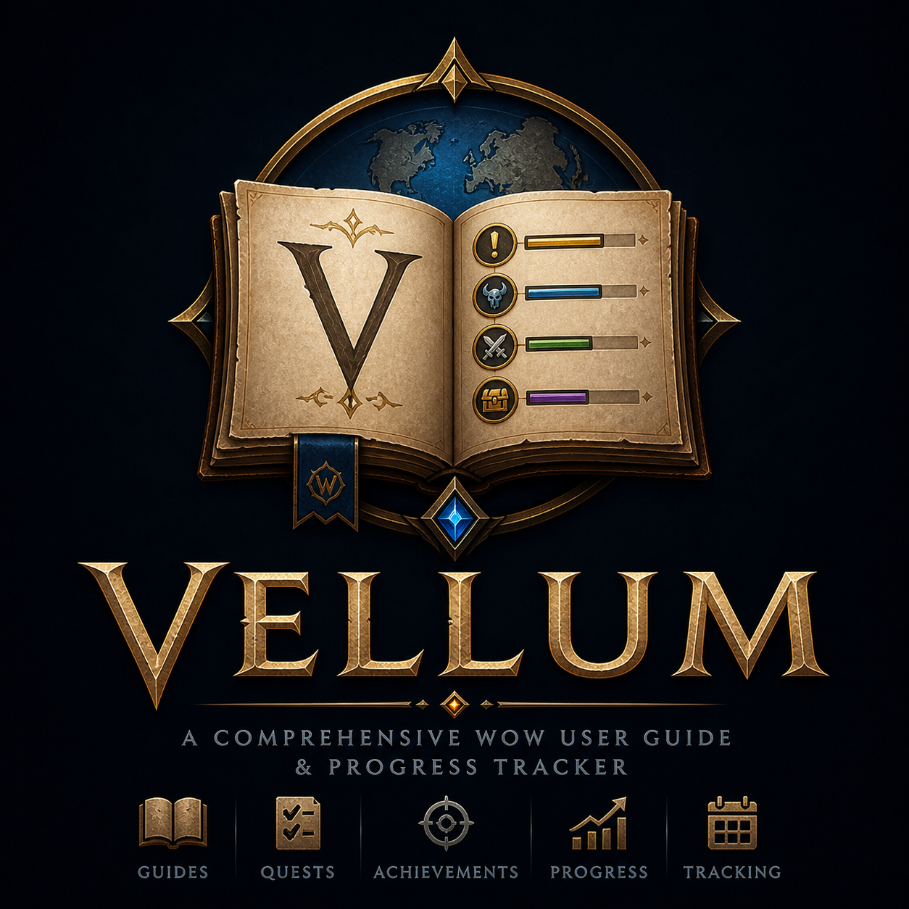

<p align="center">
  
</p>

# Vellum

**A leveling guide for World of Warcraft Retail. Stones, book, page.** Vellum picks the next quest worth doing, draws an arrow at the next waypoint, and advances the route as quests turn over. It runs on top of [LibCodex-1.0](https://github.com/ChronicTinkerer/LibCodex-1.0) for catalog data and [Cairn](https://github.com/ChronicTinkerer/Cairn) for the UI framework.

Status: **pre-1.0, single-flavor (Retail / Interface 120005), single-character profile**. The quest engine, route planner, compass arrow, Home launcher, and Step viewer are all live. Curated zone-by-zone guides, cross-zone routing, and class branching are not yet in scope. See [Roadmap](#roadmap).

---

## Table of contents

- [What it does](#what-it-does)
- [Install](#install)
- [Slash commands](#slash-commands)
- [How it works](#how-it-works)
- [Data sources](#data-sources)
- [Saved variables](#saved-variables)
- [Roadmap](#roadmap)
- [Contributing](#contributing)
- [License](#license)
- [Trademark](#trademark)
- [Acknowledgments](#acknowledgments)

---

## What it does

- **Picks the next quest for you.** A constrained TSP planner surveys quests in your log plus nearby catalog quests, filters by faction, level, map, and configurable radius, then orders them nearest-first.
- **Draws a compass arrow** that points at the active waypoint. Color shifts on approach (green at distance, wax-red close, sepia for low-confidence resolutions).
- **Two windows.** The Home launcher is the entry point: tabs for Home / Active / Recent, sidebar for Dashboard / Leveling / Zone / Dailies / Search / Favorites, and four live tiles (Guides History, Suggested Guides, Level Tracker, Gold Tracker). The Step viewer is the per-route step list with a header summary and per-row distance.
- **Adapts in real time.** Accept, abandon, or turn in a quest, change zones, level up, or move far enough that the closest waypoint changes, and the route recomputes (debounced, ~250 ms).
- **Pin support.** `/vellum follow X` pins a quest as `route[1]` so the arrow points there regardless of distance. `QUEST_ACCEPTED` auto-pins the new quest. `/vellum stop` unpins.

## Install

CurseForge / WoWInterface / Wago: search for **Vellum**. Or grab the latest release zip from the [Releases page](https://github.com/ChronicTinkerer/Vellum/releases) and unzip into `Interface\AddOns\`.

**Required dependencies** (install separately if your addon manager doesn't pull them in):

| Addon | Why |
|---|---|
| [LibCodex-1.0](https://github.com/ChronicTinkerer/LibCodex-1.0) | Quest, NPC, and POI catalog data |
| [Cairn](https://github.com/ChronicTinkerer/Cairn) | UI framework, DB, slash, events, logging |

**Optional:**

| Addon | What it adds |
|---|---|
| [TomTom](https://www.curseforge.com/wow/addons/tomtom) | Hands the active waypoint off to TomTom for its arrow / corpse-run integration |

## Slash commands

```
/vellum                       toggle the Home launcher (default action)
/vellum home                  alias of bare /vellum
/vellum guide [id|name]       open the Step viewer (no arg toggles)
/vellum follow [id|name]      pin a quest as route[1]; no arg adopts the supertracked quest
/vellum stop                  unpin, hide Step viewer, stop the arrow
/vellum status                print wiring (LibCodex / Cairn / TomTom / profile)
/vellum codex                 smoke-test the LibCodex Quests module
/vellum reset                 reset the current profile to defaults
/vellum debug                 dump every Locator layer probe for the current quest
/vellum help                  list every subcommand
/vel ...                      shorter alias for /vellum
```

`/vellum follow` accepts a numeric quest id or a partial title match against your quest log (case-insensitive).

## How it works

```
Quest catalog (LibCodex)         Quest log (C_QuestLog)
            \                              /
             v                            v
            Locator.lua  resolves coords for a (questID, objectiveIndex)
                          via 5 fallback layers (blizzard waypoint ->
                          codex-poi -> codex-npc -> codex-locations
                          -> codex-zone)
                          |
                          v
            Follower.lua  6-state machine per quest
                          (NOT_IN_LOG / OBJECTIVE / READY_TO_TURNIN /
                          DONE / ABANDONED / UNKNOWN)
                          |
                          v
            Waypoint.lua  state record -> render-ready waypoint
                          (PICKUP / OBJECTIVE / TURNIN)
                          |
                          v
        RoutePlanner.lua  candidate enumeration + nearest-neighbor
                          + 2-opt TSP, debounced recalc bus, pin
                          override, OnRouteChanged broadcast
                         /             \
                        v               v
                 Arrow.lua          StepWindow.lua / HomeWindow.lua
                 (compass)          (route list / launcher)
```

Per-file map:

| File | Role |
|---|---|
| `Core.lua` | Bootstrap, DB defaults, `/vellum` slash router |
| `Locator.lua` | Five-layer coord resolver |
| `Follower.lua` | Per-quest state machine, event subscriptions |
| `Waypoint.lua` | State record to waypoint mapper |
| `RoutePlanner.lua` | Candidate survey + NN+2-opt solver, debounce, pin |
| `Arrow.lua` | Wax-seal compass needle, parchment ring, distance label |
| `HomeData.lua` | Saved-variable backing for the four Home dashboard tiles |
| `HomeWindow.lua` | Home launcher (tabs + sidebar + tiles) |
| `StepWindow.lua` | Step viewer (route list, prev / next, refresh) |

## Data sources

Vellum reads from LibCodex-1.0's bundled catalog (DBC pulls from [wago.tools](https://wago.tools) plus targeted [Wowhead](https://wowhead.com) enrichment) and from in-client `C_QuestLog` / `C_Map` / `C_QuestPOI`. No data is fetched at runtime over the network.

If you want to augment the catalog with crowdsourced overlays from other addons (Questie, Grail, BTWQuests), file an issue. Augmentation lands at LibCodex bake time, not in Vellum itself, and license compatibility is checked per source.

## Saved variables

`VellumDB`, per-character profile, with these top-level keys under `db.profile`:

```
home          { x, y, selectedTab, sidebarSelected,
                guideHistory[], gold{}, favorites{}, timePlayed{} }
stepWindow    { x, y, tabs[], activeTab }
arrow         { x, y, scale }
engine        { mode, radius, maxWaypoints, debounceMs, pinned }
panel         (legacy v0.1 schema; harmless leftover, cleaned next migration)
```

Per [Cairn.DB](https://github.com/ChronicTinkerer/Cairn) contract, defaults are not retroactive: existing profiles get new keys lazily on first window open.

## Roadmap

Pre-1.0 is the route engine, the two windows, and the live data wiring. The polish list (in priority order):

1. Per-waypoint Complete-row strikethrough animation when an objective ticks.
2. Same-NPC waypoint bundling so a vendor row with three pickups is one stop.
3. Sidebar Options gear in the Home launcher (radius / mode / debounce / pin).
4. Active-step red left-bar in StepWindow + tab-switch animations.
5. Keyboard nav (Tab cycles tabs, arrows step within a list).
6. Cross-zone routing via a future `LibRover`-style plugin.
7. Curated guide files (zone-by-zone narration, optional layer over the engine).
8. Class / race / faction branching for guide nodes.

Out of scope on purpose for 1.0: auto-pickup of next quest, sound cues, progress bars, localization (English-only at launch).

## Contributing

Issues and pull requests welcome at [github.com/ChronicTinkerer/Vellum](https://github.com/ChronicTinkerer/Vellum/issues). For data-source ideas (other addons whose data you'd like Vellum to consume), include the source addon's name, license, and what specific data slice you want.

Local development: clone alongside `LibCodex-1.0` and `Cairn` in your `Interface\AddOns\` directory, edit Lua directly, `/reload` in-client to test. Releases are cut via `.dev/release.ps1` (sequential integer build numbers, one increment per run).

## License

**GPL-2.0-or-later.** See [LICENSE](LICENSE).

This means you may use, study, modify, and redistribute Vellum under the terms of GNU GPL version 2, or any later version. Forks must remain GPL and provide source. The choice of GPL (rather than the prior All Rights Reserved) is so Vellum can incorporate community-licensed quest, NPC, and waypoint data from other GPL-licensed WoW addons under their own license terms.

Vendored third-party code (under `Libs/`, `embeds/`, etc.) retains its own license. Cairn and LibCodex-1.0 ship under MIT and are GPL-compatible.

## Trademark

**Vellum** is a project name used by the author (Steven Landon, publishing as ChronicTinkerer). The GPL license covers the code; it does not grant you the right to publish a fork under the name "Vellum." Forks must rebrand. The CurseForge / WoWInterface / Wago project pages and the GitHub repository at `github.com/ChronicTinkerer/Vellum` are the canonical sources.

## Acknowledgments

- The Cairn / LibCodex / Vellum trio is an in-house framework. This addon would not exist without those.
- [wago.tools](https://wago.tools) for the DBC mirror that backs LibCodex.
- [Wowhead](https://wowhead.com) for the per-id quest / item / NPC enrichment data that fills DBC gaps.
- Zygor Guides set the design language for in-game leveling-guide UI; the two-window Home + Step layout takes after that pattern.
- Ace3, BigWigs, Questie, Grail, and the wider WoW addon community for prior art and the open-source culture that makes this kind of project possible.
